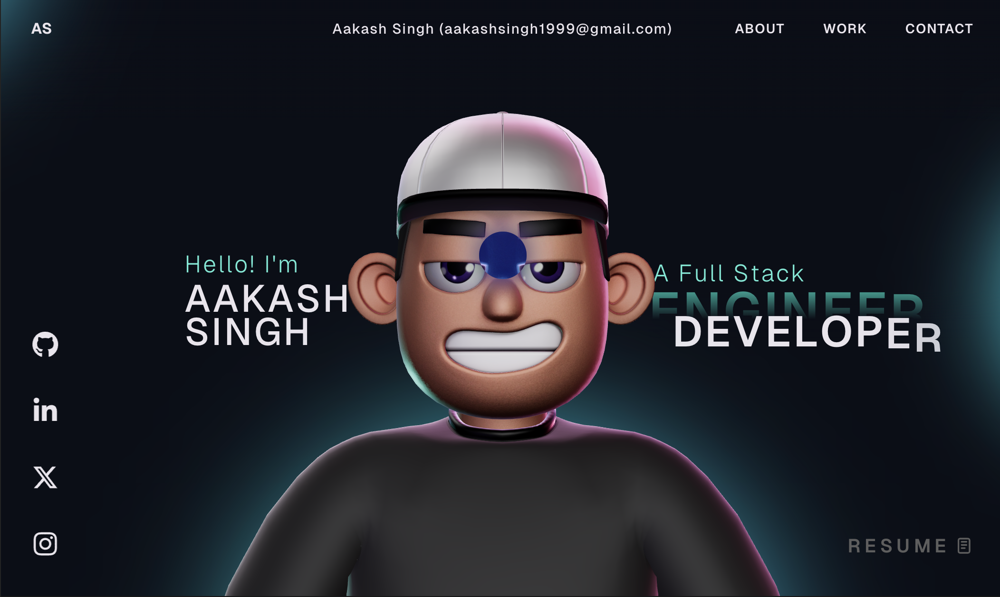
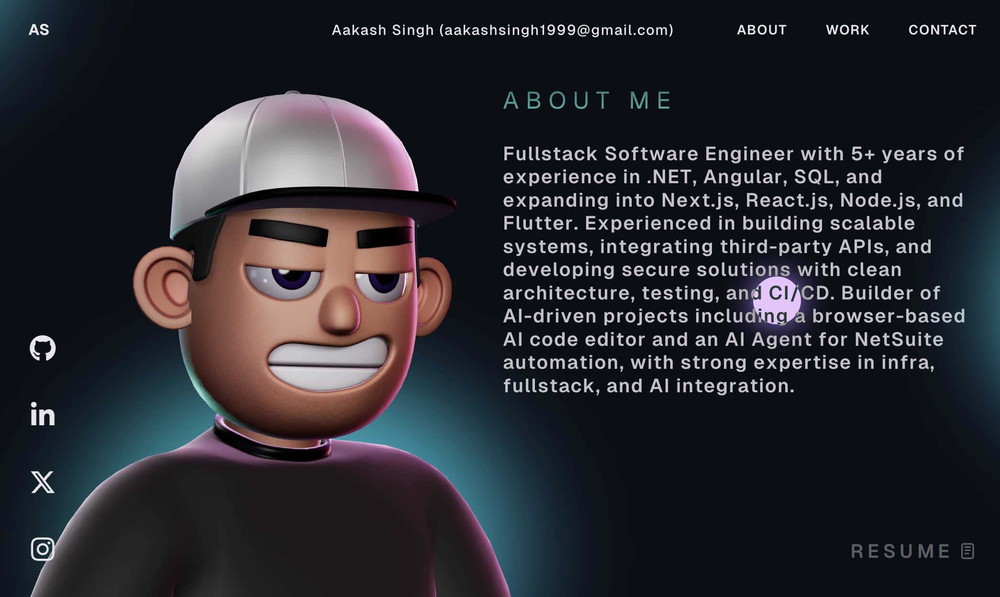

# Portfolio V2 — Aakash Singh

An interactive 3D portfolio built with React, TypeScript, Three.js, and GSAP. Features smooth scroll animations, a custom cursor, an interactive 3D character, and a project carousel.

## Preview





## Tech Stack

- **Frontend** — React, TypeScript, Vite
- **3D & WebGL** — Three.js, React Three Fiber, Drei, Rapier, Cannon
- **Animations** — GSAP, ScrollTrigger
- **Analytics** — Vercel Analytics

## Features

- Interactive 3D character model (GLB) with physics
- GSAP-powered scroll animations and split-text effects
- Custom cursor with context-aware interactions
- Project carousel showcasing work with navigation and dot indicators
- Responsive layout with desktop 3D view and mobile fallback
- Floating social icons with mouse-follow effect
- Downloadable resume

## Getting Started

```bash
# Install dependencies
npm install

# Start dev server
npm run dev

# Build for production
npm run build
```

## GSAP Club Plugins

This project uses `gsap-trial` for development. The trial plugins **cannot be used in production**. For club plugins, check out: [GSAP Installation](https://gsap.com/docs/v3/Installation/)

## Connect

- [GitHub](https://github.com/aakashrajput)
- [LinkedIn](https://www.linkedin.com/in/aakash-singh-4125b4163)
- [X (Twitter)](https://x.com/aakash_world)
- [Instagram](https://www.instagram.com/mythsandmanga)

## License

This project is open source and available under the [MIT License](LICENSE).
